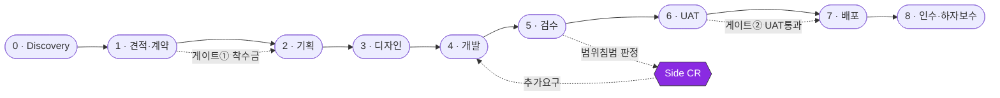
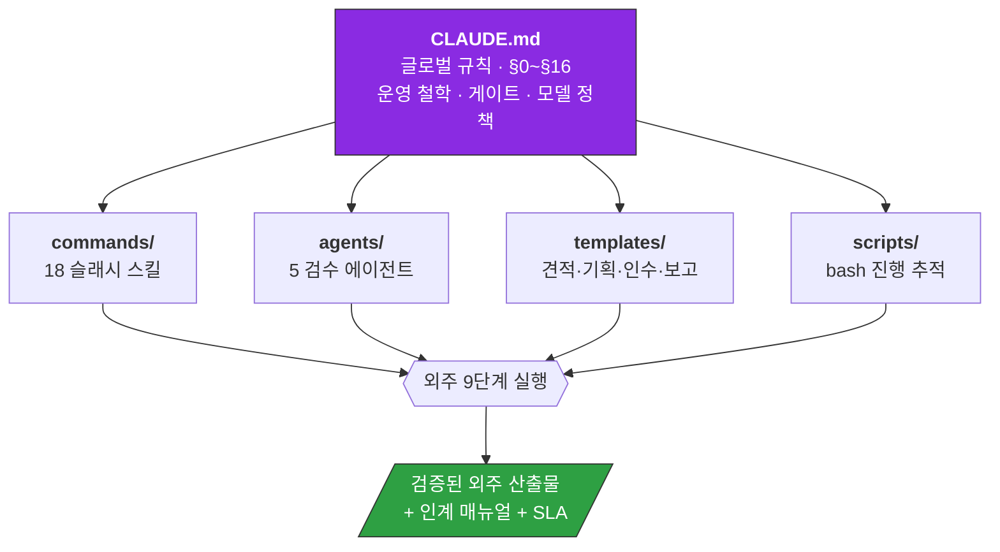

<div align="center">

# AI Workspace

### 한 명의 디렉터 + AI로 운영하는 풀스택 외주 스튜디오의 운영 체계

기획부터 인수·하자보수까지, 외주 한 건의 전 과정을 **AI-Native 워크플로**로 표준화한 거버넌스 저장소

<br/>


</div>

---

## TL;DR

> 코드는 AI가 쓴다. 사람은 **기획·판단·검수**만 한다.
> 그 "사람의 판단"을 흩어지지 않게 **문서·게이트·에이전트로 시스템화**한 것이 이 저장소다.

혼자서 — 보안 엔지니어, 접근성 전문가, 성능 분석가, UX 리뷰어, QA를 **전부 AI 서브에이전트로 고용**해서, 팀 규모의 품질 검수를 솔로로 돌린다. 계약·견적·인수·SLA 같은 비즈니스 보호 장치까지 워크플로에 박아넣었다.

---

## 핵심 숫자

| | | |
|---:|:---|:---|
| **9** | 단계 워크플로 | Discovery → 인수·하자보수 (0~8단계) |
| **18** | 슬래시 스킬 | `/견적` `/기획` `/전수검사` `/상태` `/이슈동기화` … |
| **5** | 검수 서브에이전트 | security · accessibility · performance · ux · plan-compliance |
| **3** | 불변 품질 게이트 | 착수금 / UAT 통과 / Production 사용자 확인 |
| **3** | 모델 라우팅 | Opus(사고) · Sonnet(구현) · Haiku(반복) 자동 분배 |
| **17** | 거버넌스 섹션 | §0 운영 철학 ~ §16 기획 크래프트 |

---

## 9-Stage AI-Native 워크플로



각 단계마다 **전용 슬래시 스킬 · 산출물 · 통과 게이트 · 권장 모델**이 정의되어 있다.
"이 단계를 생략하면 분쟁 시 책임 한계 보호가 가능한가?" — 답이 아니오면 생략 불가.

---

## 실시간 진행 대시보드 (토큰 0)

세션을 열면 — 또는 `/상태` 한 번이면 — 현 외주가 9단계 중 어디까지 왔는지, 게이트가 막혔는지, 다음에 뭘 해야 하는지가 **즉시** 뜬다. LLM 분석 없이 산출물 파일만 bash로 스캔하므로 **토큰 소모 0**.

```text
═══ 외주 진행상황 · acme-commerce ═══
[v] 0 Discovery     [v] 1 견적·계약    [v] 2 기획
[v] 3 디자인        [v] 4 개발         [v] 5 검수
[ ] 6 UAT           [ ] 7 배포         [ ] 8 인수

─── 게이트 ───
[v] 게이트① 착수금 확인됨
[ ] 게이트② UAT 미통과 2건 → Production 배포 불가

─── 다음 권장 행동 ───
→ 6단계: /UAT (미통과 0건까지)
```

여러 클라이언트를 오갈 때 "이 외주 어디까지 했지?"를 0초에 복구한다.

---

## 왜 특별한가 — AI를 "그냥 쓰는 것"과의 차이

<table>
<tr>
<td width="50%">

### 모델 비용 라우팅
작업 종류에 따라 Opus / Sonnet / Haiku를 자동 선택.
견적·기획·보안엔 최고 정확도, 보일러플레이트엔 최저 비용 — **마진을 모델 선택으로 지킨다.**

</td>
<td width="50%">

### 8-에이전트 병렬 검수
보안·접근성·성능·UX·기획준수·기능·시나리오·회귀를 **동시에** 검수.
솔로가 팀 규모 QA를 갖는 구조.

</td>
</tr>
<tr>
<td width="50%">

### Living Documentation
프로젝트별 `CLAUDE.md`가 단일 진실 원천(SSOT).
요구사항·In/Out-Scope·화면·상태·위험 매트릭스를 한 문서에 담아 AI가 항상 전체 맥락을 들고 일한다.

</td>
<td width="50%">

### 자기 회고 루프
프로젝트 종료 시 AI가 **자기 프로세스를 비즈니스 언어로 회고**하고 개선안을 제안.
사람은 "유지/변경"의 경영 판단만 내린다.

</td>
</tr>
<tr>
<td width="50%">

### 검증 가능 표면적 최소화
코드를 안 읽고 **시각 검수로 품질을 판정**하는 구조에 맞춰, 기획 단계에서 화면·상태·경로를 통합해 검수 비용 자체를 설계로 줄인다.

</td>
<td width="50%">

### Spec-First / 테스트 자산화
critical flow는 **수용 테스트를 먼저 합의 → 통과까지 구현**.
사람은 코드가 아니라 ✅/❌만 본다. 회귀는 코드로 영속화.

</td>
</tr>
</table>

---

## 생태계 벤치마킹 — 좋은 건 훔쳐 온다

범용 멀티에이전트 프레임워크(OMC·Ruflo·SuperClaude)와 스펙주도 PM(CCPM·BMAD)을 분석해, **이 비즈니스 운영체계에 맞는 패턴만 선별 이식**했다.

| 출처 | 빌려온 것 | 적용 |
|---|---|---|
| **CCPM** | bash 기반 진행 추적 (no-LLM) | `/상태` 대시보드 + SessionStart 자동 표시 |
| **CCManager** | git worktree 다중 세션 관리 | 여러 클라이언트 외주 병렬 운영 |
| **OMC / Ruflo** | 모델 라우팅 · 병렬 에이전트 사상 | §12 모델 정책 · 8-에이전트 검수 |
| **GitHub Issues** | 클라이언트가 진행상황 직접 열람 | `/이슈동기화` — In-Scope를 Issues로 발행 (CCPM식) |

> 거버넌스(계약·책임·게이트) 외피는 이 저장소만의 것 — 어떤 범용 플러그인에도 없다.
> 코드 속도·세션 관리 같은 수평 기능은 직접 만들지 않고 **생태계를 부품으로 흡수**한다.

---

## 오케스트레이션 구조



---

## 저장소 구조

```
ai-workspace/
├── claude-code/          # Claude Code 글로벌 설정 (단일 원본)
│   ├── CLAUDE.md         #   외주 워크플로 v2.0 + 운영 철학 + 엔지니어링/품질 표준
│   ├── settings.json     #   권한 · 게이트 강제 hook · SessionStart 대시보드 · statusLine
│   ├── commands/         #   슬래시 스킬 18종
│   ├── agents/           #   검수 서브에이전트 5종
│   ├── templates/        #   문서 템플릿 4종
│   └── scripts/          #   bash 진행 추적 · GitHub 라벨 세트
├── prompts/              # 재사용 프롬프트 라이브러리
├── knowledge/            # "AI를 더 잘 쓰는 법" 지식 베이스
└── tools/                # 기타 AI 도구 설정·메모
```

> `claude-code/`의 파일이 **진짜 원본**이고, `~/.claude/`의 항목들이 이 저장소를 **심볼릭 링크로 가리킨다.**
> 평소처럼 설정을 수정하면 곧바로 버전 관리된다 — 별도 동기화 불필요. 한 번 clone하면 새 기기에서도 동일 환경이 복원된다.

---

## 거버넌스 하이라이트

**3개 불변 게이트** — 어떤 자동화도 우회 불가
1. 착수금 입금 확인 → 기획 진입
2. UAT 전 항목 통과 → Production 배포
3. 사용자 명시 확인 → Production 배포

**계약 책임 5조항** — 모든 견적에 자동 삽입 (In/Out-Scope · 인수 정의 · 하자보수 · 클라이언트 책임 · 영업 확장 별도 견적)

**한 줄 원칙**
> 게이트는 뼈대, 실행은 판단. 절차를 따르는 게 목적이 아니라, 절차가 보호하려는 결과를 만드는 게 목적이다.

---

<div align="center">

**Built & operated with [Claude Code](https://claude.com/claude-code)**

기획하는 사람 1명 · 일하는 AI 다수

</div>
